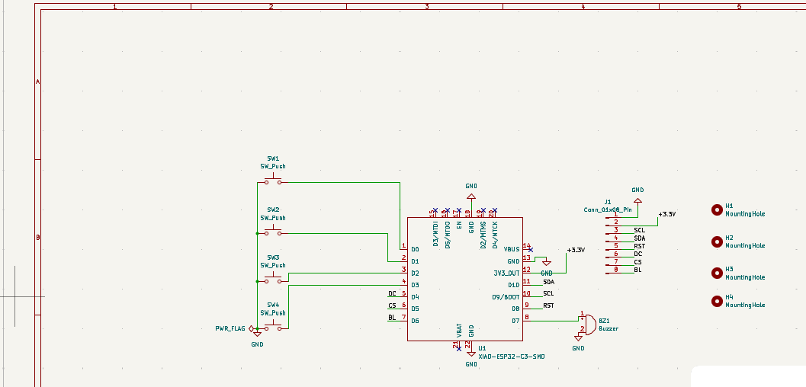
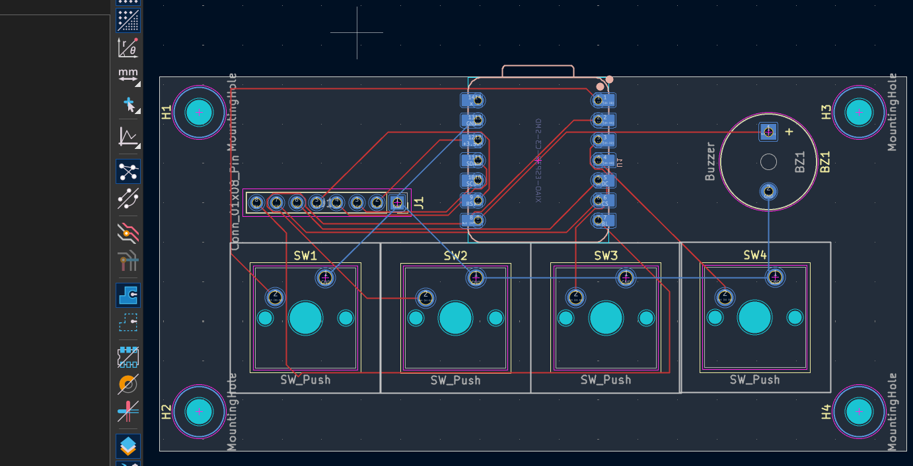
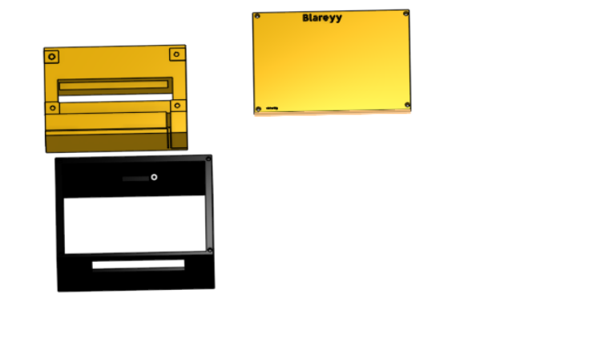
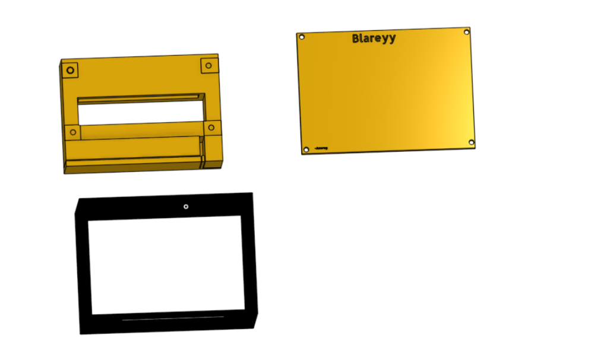

Blareyy a alarm clock

Component:
1x Seeed Studio XIAO ESP32-C3
1x 284x76 ST7789 TFT Module
4x Momentary Push Buttons
1x Active Buzzer
1x 1x08 2.54mm Header
4x M2 / M2.5 Screws 

 Images

Schematic

PCB Layout

3D Enclosure Render
, 
