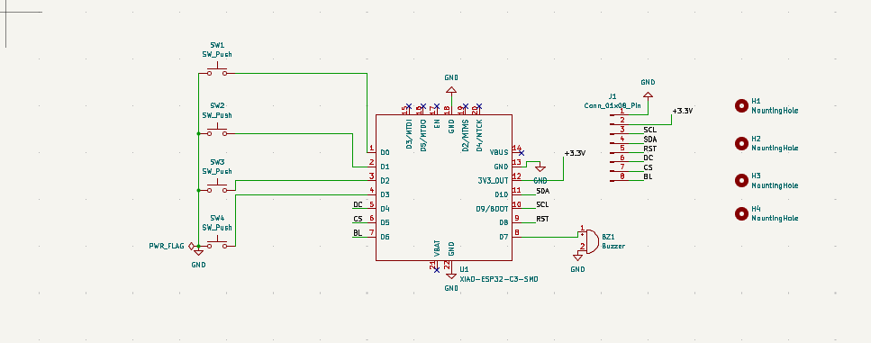
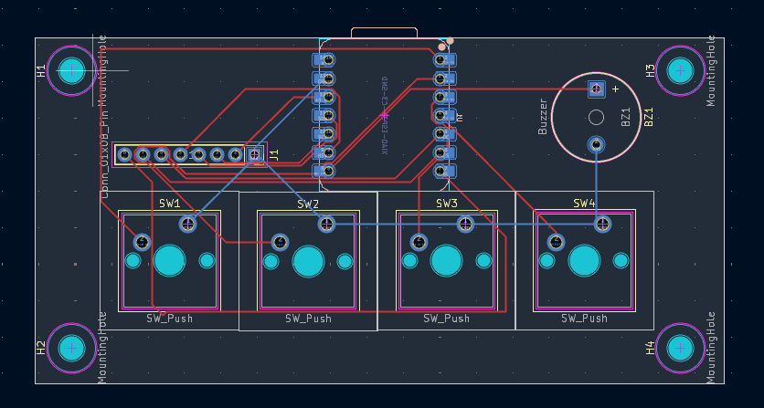
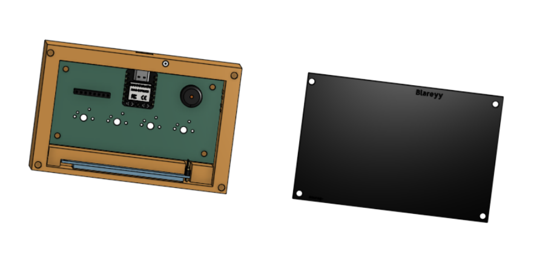
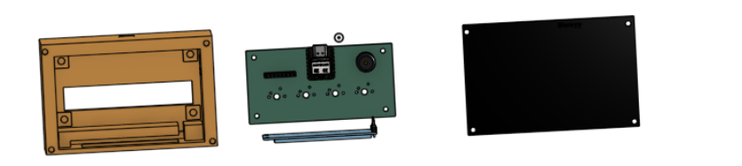

Blareyy a alarm clock

BOM:
1x Seeed XIAO ESP32C3
12x MX-Style Keyboard Switches
12x White Blank DSA Keycaps
12x Through-Hole 1N4148 Diodes
1x 2.25in TFT Screen
1x 3.3V Piezo Buzzer
1x 2.54mm 8 Pin Male Header (For connecting your screen)
8x 20cm Female-Female Jumper Wires (For connecting your screen off of the pcb)
8x M3x5x4 Heatset Inserts
4x M3x8mm Screws
4x M3x16mm Screws

 Images

Schematic

PCB Layout

3D Enclosure Render
, 
